# Hi there, I'm Mohammed Abidou 👋

<div align="center">
  
</div>

<div align="center">
  
</div>

<br>

<div align="center">
  
  [](https://www.linkedin.com/in/mohammed-abidou-603284270)
  [](mailto:abidou.mohammed03@gmail.com)
  [](#)
  [](https://github.com/yourusername)
  
</div>

<div align="center">
  
  
  
  
</div>


## 🚀 About Me

<table>
<tr>
<td width="50%">

> **Computer Engineering Graduate & Cyberdefense Specialist** with hands-on experience in SIEM deployment, network security, full-stack web development, and AI integration. Trained at DataProtect/JobInTech on enterprise-grade security solutions, with a proven track record building scalable Django applications.

- 🎓 **BSc Computer Engineering** — FST Settat (2022-2025)
- 🛡️ **Latest:** Cyberdefense Trainee at JobInTech × DataProtect
- 💼 **Previously:** Full-Stack Developer Intern at ADVAL Maroc
- 🔐 **Certified:** CompTIA Security+ · Fortinet FCA Cybersecurity
- 🔒 **Specialized in:** SIEM, SOC, Firewalls, Django REST, AI Integration
- 🌍 **Languages:** Arabic (Native) · French (Fluent) · English (B2)
- ⚡ **Passion:** Securing & building intelligent web solutions

</td>
<td width="50%">

```python
class MohammedAbidou:
    def __init__(self):
        self.name = "Mohammed Abidou"
        self.role = "Full Stack Dev & Cyberdefense"
        self.location = "Berrechid, Morocco 🇲🇦"
        self.languages = ["Python", "Java", "JavaScript",
                          "PHP", "Bash", "C"]
        self.security = ["IBM QRadar", "Palo Alto",
                         "Fortinet", "Kaspersky EDR"]
        self.dev_stack = ["Django", "REST APIs", "Azure"]
        self.certifications = [
            "CompTIA Security+",
            "Fortinet FCA Cybersecurity"
        ]
    
    def say_hi(self):
        return "Let's secure & build something amazing! 🚀"
```

</td>
</tr>
</table>


## 🛡️ Certifications

<div align="center">

<table>
<tr>
<td align="center" width="300px">

<br><br>
<strong>CompTIA Security+</strong>
<br>
<sub>Threat Management · Risk Mitigation · Cryptography · Identity Management</sub>
</td>
<td align="center" width="300px">

<br><br>
<strong>Fortinet Certified Associate</strong>
<br>
<sub>Network Security · Firewall Configuration · Threat Landscape · FortiGate</sub>
</td>
</tr>
</table>

</div>


## 🛠️ Tech Arsenal

<div align="center">

### 💎 Programming Languages
<table>
<tr>
<td align="center" width="100px">

<br><strong>Python</strong>
</td>
<td align="center" width="100px">

<br><strong>Java</strong>
</td>
<td align="center" width="100px">

<br><strong>JavaScript</strong>
</td>
<td align="center" width="100px">

<br><strong>PHP</strong>
</td>
<td align="center" width="100px">

<br><strong>C</strong>
</td>
<td align="center" width="100px">

<br><strong>Bash</strong>
</td>
</tr>
</table>

### 🛡️ Cybersecurity & Infrastructure
<table>
<tr>
<td align="center" width="120px">

<br><strong>IBM QRadar</strong>
<br><sub>SIEM</sub>
</td>
<td align="center" width="120px">

<br><strong>Zabbix</strong>
<br><sub>Monitoring</sub>
</td>
<td align="center" width="120px">

<br><strong>Palo Alto</strong>
<br><sub>NGFW</sub>
</td>
<td align="center" width="120px">

<br><strong>Fortinet</strong>
<br><sub>NGFW / VPN</sub>
</td>
<td align="center" width="120px">

<br><strong>Kaspersky</strong>
<br><sub>EP / EDR</sub>
</td>
</tr>
<tr>
<td align="center" width="120px">

<br><strong>Wallix</strong>
<br><sub>PAM</sub>
</td>
<td align="center" width="120px">

<br><strong>SafeNet</strong>
<br><sub>MFA</sub>
</td>
<td align="center" width="120px">

<br><strong>Symantec PGP</strong>
<br><sub>Encryption</sub>
</td>
<td align="center" width="120px">

<br><strong>Linux</strong>
<br><sub>Administration</sub>
</td>
<td align="center" width="120px">

<br><strong>Win Server</strong>
<br><sub>AD / GPO</sub>
</td>
</tr>
</table>

### 🌐 Networking


### 🎨 Web Development — Frontend & Backend
<table>
<tr>
<td align="center" width="100px">

<br><strong>Django</strong>
</td>
<td align="center" width="100px">

<br><strong>HTML5</strong>
</td>
<td align="center" width="100px">

<br><strong>CSS3</strong>
</td>
<td align="center" width="100px">

<br><strong>Tailwind</strong>
</td>
<td align="center" width="100px">

<br><strong>Bootstrap</strong>
</td>
<td align="center" width="100px">

<br><strong>WordPress</strong>
</td>
</tr>
</table>

### 🗄️ Database, Cloud & Tools
<table>
<tr>
<td align="center" width="100px">

<br><strong>MySQL</strong>
</td>
<td align="center" width="100px">

<br><strong>Azure</strong>
</td>
<td align="center" width="100px">

<br><strong>Git</strong>
</td>
<td align="center" width="100px">

<br><strong>VS Code</strong>
</td>
<td align="center" width="100px">

<br><strong>Postman</strong>
</td>
</tr>
</table>

### 🏆 Training & Specializations


</div>


## 💼 Professional Journey

<div align="center">


</div>

### 🔹 Cyberdefense Trainee | **JobInTech × DataProtect**
*August 2025 — January 2026*

<table>
<tr>
<td width="60%">

**Key Achievements:**
- 🔍 **SIEM Deployment:** Deployed IBM QRadar with 10+ custom threat detection use cases and correlation rules
- 📡 **Infrastructure Monitoring:** Configured Zabbix with custom templates, dashboards & alert systems on Windows Server
- 🧱 **Firewall Architecture:** Implemented Palo Alto & Fortinet NGFW with IPsec site-to-site VPN tunnels
- 🛡️ **Endpoint Security:** Trained on Kaspersky EP/EDR for advanced threat protection
- 🔐 **Access Control:** Worked with Wallix PAM & SafeNet MFA for privileged access management
- 🔒 **Encryption:** Deployed Symantec PGP for data protection at rest

</td>
<td width="40%">

**Technologies Used:**
```yaml
SIEM: IBM QRadar
Monitoring: Zabbix
Firewall: Palo Alto, Fortinet
VPN: IPsec Site-to-Site
Endpoint: Kaspersky EP/EDR
PAM: Wallix Bastion
MFA: SafeNet
Encryption: Symantec PGP
OS: Windows Server, Linux
Infra: Active Directory, GPO
Network: VLAN, DHCP, NAT, DNS
```

</td>
</tr>
</table>

### 🔹 IT & Web Development Intern | **ADVAL Maroc**
*April 2024 — July 2024*

<table>
<tr>
<td width="60%">

**Key Achievements:**
- 🚀 **Full-Stack Development:** Built robust web applications using Django & Django REST Framework
- 🤖 **AI Integration:** Implemented cutting-edge AI APIs for innovative business solutions  
- ☁️ **Cloud Deployment:** Optimized website performance and security on Azure platform
- 📊 **Database Design:** Created efficient MySQL database architectures
- 🎨 **WordPress Mastery:** Developed custom themes and plugins with security best practices

</td>
<td width="40%">

**Technologies Used:**
```yaml
Backend: Django, Django REST, PHP
Frontend: HTML5, CSS3, JavaScript
Database: MySQL, Optimization
Cloud: Microsoft Azure
CMS: WordPress
Tools: Git, VS Code, Postman
```

</td>
</tr>
</table>

### 🔹 Freelance WordPress Developer
*July 2023 — July 2024*

- 🌐 **Custom Development:** Created bespoke WordPress solutions for diverse clients
- 💰 **Marketplace Success:** Built and sold 5+ complete digital assets on platforms like Flippa
- 📈 **Brand Development:** Delivered comprehensive branding and web presence packages
- 🎯 **Client Satisfaction:** Maintained 100% project completion rate with positive feedback


## 🔬 Featured Project

<div align="center">

### 🛡️ SIEM Deployment & Monitoring Infrastructure
**End-of-Training Capstone — JobInTech × DataProtect**

</div>

<table>
<tr>
<td width="50%">

**Project Scope:**
- 📊 Full IBM QRadar deployment: installation, log source configuration, correlation rules, and 10+ detection use cases
- 📡 Zabbix monitoring setup: custom templates, performance dashboards, and automated alerting
- 🧱 Secure network architecture with Palo Alto & Fortinet firewalls (IPsec site-to-site VPN)
- 🔐 Complete endpoint protection stack with Kaspersky, Wallix PAM, and SafeNet MFA

```mermaid
graph TD
    A[🌐 Network Traffic] --> B[🧱 Palo Alto / Fortinet NGFW]
    B --> C[📊 IBM QRadar SIEM]
    B --> D[📡 Zabbix Monitoring]
    C --> E[🚨 Threat Detection]
    C --> F[📋 Correlation Rules]
    D --> G[📈 Dashboards & Alerts]
    H[💻 Endpoints] --> I[🛡️ Kaspersky EP/EDR]
    I --> C
    J[👤 Users] --> K[🔐 Wallix PAM + SafeNet MFA]
    K --> H
```

</td>
<td width="50%">



</td>
</tr>
</table>


## 📊 GitHub Analytics

<div align="center">
  
  
</div>

<div align="center">
  
</div>

<div align="center">
  
</div>


## 🎯 Expertise Matrix

<div align="center">

<table>
<thead>
<tr>
<th>🛡️ Cybersecurity & SOC</th>
<th>🌐 Web Development</th>
<th>🤖 AI & Innovation</th>
<th>🖧 Infrastructure</th>
</tr>
</thead>
<tbody>
<tr>
<td align="center">
<br>
✅ SIEM (IBM QRadar)<br>
✅ NGFW (Palo Alto, Fortinet)<br>
✅ Endpoint Security (EDR)<br>
✅ PAM & MFA Solutions<br>
✅ VPN IPsec Architecture<br>
✅ Threat Detection & Response<br>
✅ Vulnerability Assessment<br>
<br>
</td>
<td align="center">
<br>
✅ Full-Stack Architecture<br>
✅ Django & REST API Design<br>
✅ Responsive UI/UX<br>
✅ Performance Optimization<br>
✅ WordPress Customization<br>
✅ Secure Coding Practices<br>
✅ Cloud Deployment (Azure)<br>
<br>
</td>
<td align="center">
<br>
🧠 Prompt Engineering<br>
⚡ AI API Integration<br>
🔮 Generative AI Solutions<br>
🚀 Innovation Implementation<br>
🎯 Intelligent Automation<br>
<br>
</td>
<td align="center">
<br>
🖥️ Windows Server Admin<br>
🐧 Linux Administration<br>
📁 Active Directory & GPO<br>
🌐 VLAN / DHCP / DNS / NAT<br>
📡 Zabbix Monitoring<br>
☁️ Azure Cloud Infra<br>
📊 Performance Monitoring<br>
<br>
</td>
</tr>
</tbody>
</table>

</div>


## 🎓 Education

<div align="center">

| 🗓️ Period | 🎓 Degree | 🏫 Institution |
|:---:|:---|:---|
| **2022 — 2025** | **BSc Computer Engineering** (Licence ST Génie Informatique) | FST Settat |
| **2021 — 2022** | **DEUG SMIA** (Mathematics, CS & Physics) | Université Chouaïb Doukkali, El Jadida |
| **2021** | **Baccalauréat Sciences Expérimentales** — Sciences Physiques | High School |

</div>


## 🌍 Languages

<div align="center">


</div>


## 🌟 Passion Projects & Interests

<div align="center">

<table>
<tr>
<td width="33%" align="center">

<br><br>
<strong>♟️ Strategic Chess</strong>
<br>
<em>Developing analytical thinking and strategic planning skills through competitive chess</em>
</td>
<td width="33%" align="center">

<br><br>
<strong>⚽ Football Enthusiast</strong>
<br>
<em>Team collaboration and physical fitness through the beautiful game</em>
</td>
<td width="33%" align="center">

<br><br>
<strong>🔬 Tech Innovation</strong>
<br>
<em>Exploring emerging technologies and contributing to open-source projects</em>
</td>
</tr>
</table>

</div>


## 🎯 Current Focus & Goals

<div align="center">


</div>

### 🚀 Roadmap Ahead
- 🛡️ **Pursuing** SOC Analyst / Security Engineer roles leveraging SIEM & EDR expertise
- 🔥 **Contributing** to open-source cybersecurity & Django projects
- 📚 **Advancing** toward OSCP and advanced security certifications
- 🤖 **Integrating** AI/ML into security operations and automation (SOAR)
- 🌍 **Building** secure, scalable solutions with global impact
- 👥 **Mentoring** upcoming developers and security professionals


## 📫 Let's Connect & Collaborate!

<div align="center">

**"The best code is not just functional — it's elegant, secure, and tells a story."**

<br>

[](https://www.linkedin.com/in/mohammed-abidou-603284270)
[](mailto:abidou.mohammed03@gmail.com)

<br>

**Open for:**
- 🛡️ SOC Analyst & Cybersecurity positions
- 🤝 Collaboration on security & Django projects
- 💼 Full-time opportunities in cybersecurity & web development
- 🎯 Freelance Django & WordPress projects
- 🌱 Mentoring and knowledge sharing
- 🚀 Innovation and startup ventures

</div>


<div align="center">
  
</div>

---

<div align="center">
  <sub>💫 Crafted with passion and precision by Mohammed Abidou</sub>
</div>
